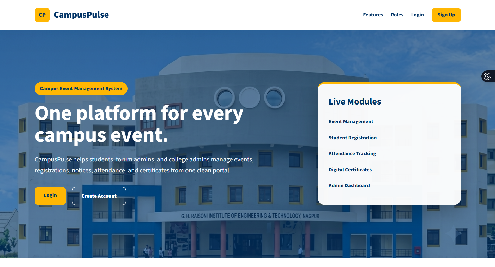
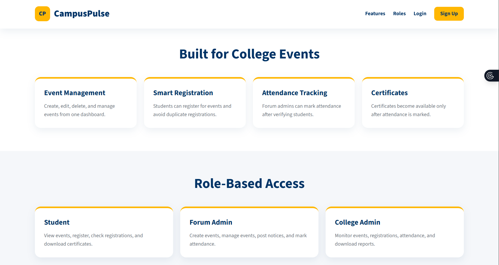
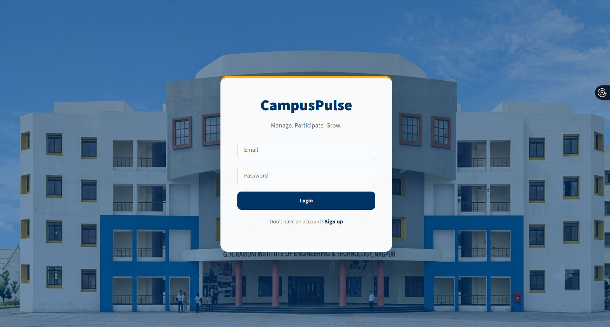
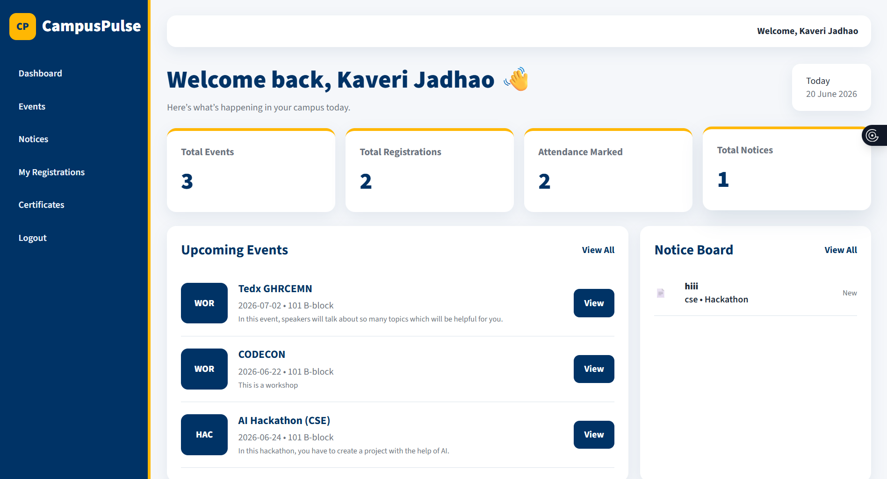
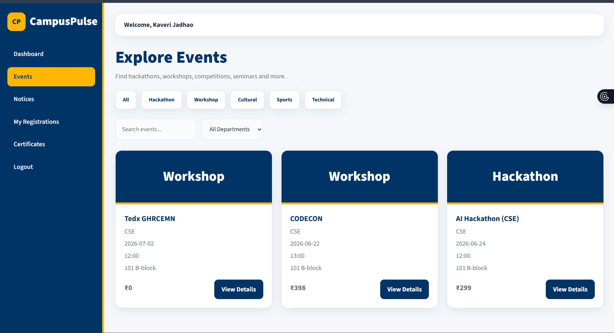
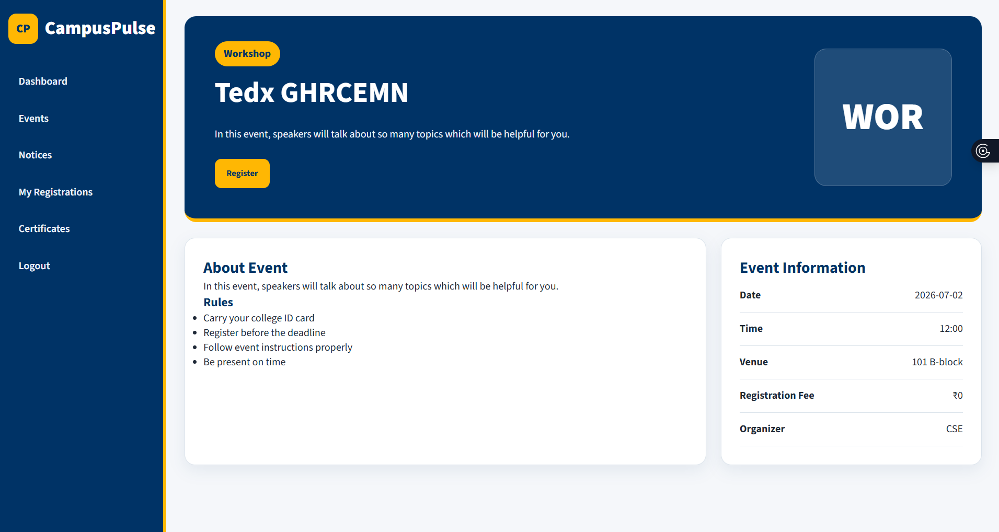
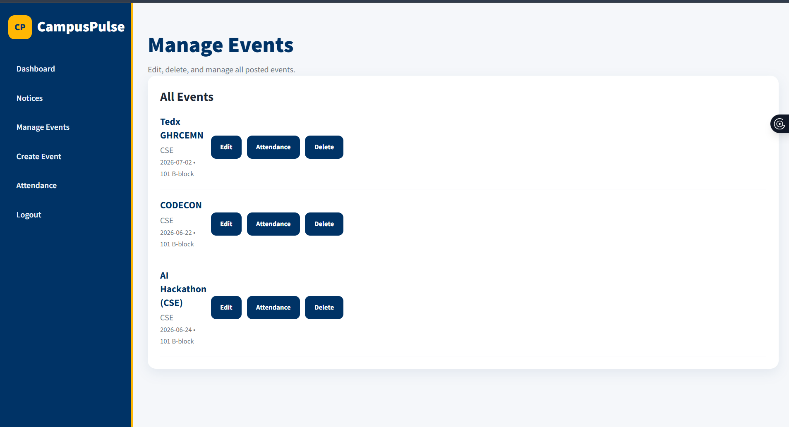
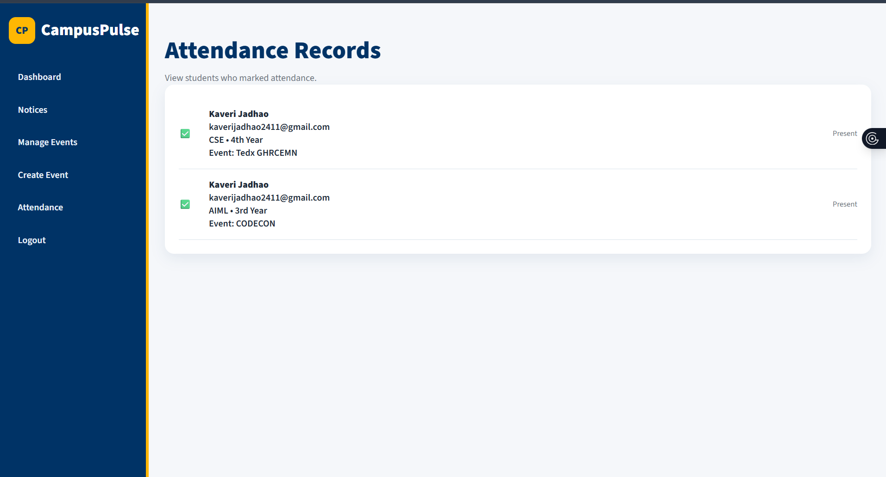
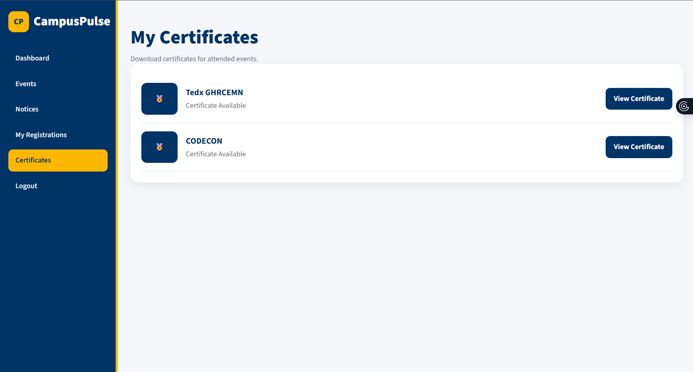
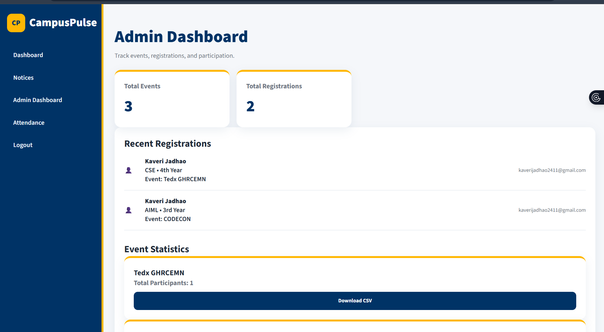

# CampusPulse

CampusPulse is a full-stack college event management platform designed to streamline event discovery, registrations, attendance tracking, notices, and certificate generation.

## Live Demo

Frontend: https://your-vercel-link.vercel.app

## Features

### Student

* View events
* Register for events
* View registrations
* Download certificates
* Access notices

### Forum Admin

* Create events
* Manage events
* Mark attendance

### College Admin

* View statistics
* Manage platform activities

## Tech Stack

### Frontend

* HTML
* CSS
* JavaScript

### Backend

* Node.js
* Express.js

### Database

* MongoDB Atlas

### Deployment

* Vercel
* Render

## Role-Based Access Control

* Student
* Forum Admin
* College Admin

# Project Screenshots

## Home Page

## Login Page

## Student Dashboard

## Events Page

## Event Details

## Manage Events

## Attendance System

## Certificate Generation

## Admin Dashboard

## Future Enhancements

* QR Attendance
* Email Notifications
* Mobile App
* Event Analytics

## Author

Kaveri Jadhao

Computer Science Engineering

GH Raisoni College of Engineering & Management (Nagpur)
